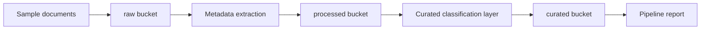

# document-intelligence-minio-pipeline

Este projeto mostra como estruturar um pipeline de **document intelligence** sobre **MinIO**, usando a compatibilidade com a API `S3` para organizar artefatos em camadas `raw`, `processed` e `curated`.

O objetivo aqui nao e fazer OCR pesado ou NLP complexo. O objetivo e mostrar a **arquitetura de storage e processamento documental**, com uma implementacao local reproduzivel e pronta para evoluir para um servidor MinIO real.

## O que o projeto faz

1. Gera um corpus documental local com contratos, invoices, relatorios de manutencao, politicas e checklists.
2. Escreve os textos originais no bucket `raw`.
3. Extrai metadados simples como `word_count`, `character_count` e um `summary`.
4. Salva os metadados estruturados no bucket `processed`.
5. Cria uma camada `curated` com classificacao documental orientada a consumo.
6. Gera um relatorio consolidado para observabilidade do pipeline.

## Por que usar MinIO aqui

`MinIO` e um object store compativel com `S3`. Isso permite treinar padroes que aparecem em ambientes reais de dados e MLOps sem depender diretamente da AWS.

Neste projeto, ele representa bem cenarios como:

- data lake documental;
- armazenamento de artefatos de OCR/NLP;
- staging de documentos para pipelines posteriores;
- organizacao por buckets e prefixos;
- separacao entre dado bruto, dado processado e dado pronto para consumo.

## Arquitetura



## Estrutura do repositorio

- [main.py](/Users/flaviagaia/Documents/CV_FLAVIA_CODEX/document-intelligence-minio-pipeline/main.py)  
  Entry point local do pipeline.

- [app.py](/Users/flaviagaia/Documents/CV_FLAVIA_CODEX/document-intelligence-minio-pipeline/app.py)  
  API simples com endpoint de execucao.

- [src/sample_data.py](/Users/flaviagaia/Documents/CV_FLAVIA_CODEX/document-intelligence-minio-pipeline/src/sample_data.py)  
  Gera o corpus documental local e a referencia do runtime MinIO.

- [src/storage.py](/Users/flaviagaia/Documents/CV_FLAVIA_CODEX/document-intelligence-minio-pipeline/src/storage.py)  
  Implementa a resolucao entre runtime real `MinIO` e fallback local por filesystem.

- [src/pipeline.py](/Users/flaviagaia/Documents/CV_FLAVIA_CODEX/document-intelligence-minio-pipeline/src/pipeline.py)  
  Faz ingestao, escrita em buckets, enrichments simples e relatorio final.

- [tests/test_project.py](/Users/flaviagaia/Documents/CV_FLAVIA_CODEX/document-intelligence-minio-pipeline/tests/test_project.py)  
  Garante o contrato minimo do pipeline.

## Runtime modes

O projeto funciona em dois modos:

### 1. `minio_s3_api`
Ativado quando estas variaveis estao disponiveis:

- `MINIO_ENDPOINT`
- `MINIO_ACCESS_KEY`
- `MINIO_SECRET_KEY`
- opcional `MINIO_SECURE`

Nesse modo, o pipeline grava objetos em um servidor MinIO real.

### 2. `local_filesystem_fallback`
Se o runtime MinIO nao estiver configurado, o projeto usa uma simulacao local em:

- `data/object_store/raw`
- `data/object_store/processed`
- `data/object_store/curated`

Esse fallback permite manter o repositorio executavel, testavel e demonstravel sem dependencia externa.

## Como executar

```bash
python3 main.py
```

Para rodar a API:

```bash
uvicorn app:app --reload
```

## Endpoints

- `GET /health`
- `POST /run`

## Resultado atual

- `dataset_source = document_intelligence_minio_local_sample`
- `runtime_mode = local_filesystem_fallback`
- `document_count = 6`
- `raw_object_count = 6`
- `processed_object_count = 6`
- `curated_object_count = 6`
- `maintenance_signal_documents = 1`

## Artefatos gerados

- relatorio consolidado:
  [document_intelligence_minio_report.json](/Users/flaviagaia/Documents/CV_FLAVIA_CODEX/document-intelligence-minio-pipeline/data/processed/document_intelligence_minio_report.json)
- camada curated:
  [curated_documents.json](/Users/flaviagaia/Documents/CV_FLAVIA_CODEX/document-intelligence-minio-pipeline/artifacts/curated_documents.json)

## Leitura tecnica

O ponto mais importante deste projeto nao e a extracao em si, mas o desenho do pipeline documental:

- bucket `raw` representa a entrada imutavel;
- bucket `processed` representa enrichments e metadados derivados;
- bucket `curated` representa dados prontos para consumo por busca, analytics, OCR posterior ou agentes;
- o relatorio final funciona como artefato de observabilidade do run.

Esse desenho e muito util para:

- OCR pipelines;
- document AI;
- compliance document stores;
- RAG com repositório documental;
- armazenamento de artefatos de MLOps.

## English

This project shows how to structure a **document intelligence pipeline** on top of **MinIO**, using `S3-compatible object storage` to organize artifacts across `raw`, `processed`, and `curated` layers.

The goal is not heavy OCR or advanced NLP. The goal is to demonstrate a **document-storage architecture** with a reproducible local runtime that can be upgraded to a real MinIO server.

### What the project does

1. Generates a local corpus with contracts, invoices, maintenance reports, policies, and checklists.
2. Writes original text into the `raw` bucket.
3. Extracts lightweight metadata such as `word_count`, `character_count`, and a short `summary`.
4. Stores structured metadata in the `processed` bucket.
5. Builds a `curated` layer with document-level classification.
6. Produces a consolidated report for run observability.

### Why MinIO matters here

`MinIO` is `S3-compatible object storage`. That makes it a strong way to practice patterns used in real-world data platforms and MLOps environments without depending directly on AWS.

### Runtime behavior

The repository supports:

- `minio_s3_api`: real MinIO-backed storage when credentials are configured;
- `local_filesystem_fallback`: deterministic local simulation when MinIO is not available.

### Current result

- `dataset_source = document_intelligence_minio_local_sample`
- `runtime_mode = local_filesystem_fallback`
- `document_count = 6`
- `raw_object_count = 6`
- `processed_object_count = 6`
- `curated_object_count = 6`
- `maintenance_signal_documents = 1`
